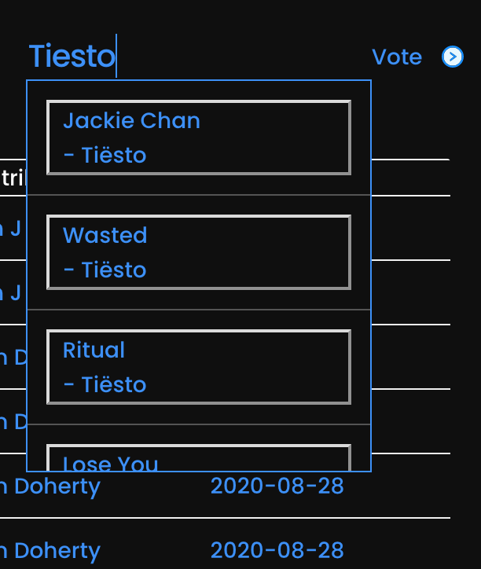

# Vote-Ify

[Check it out here.](https://spotify-us.herokuapp.com/)

[The client repo is here.](https://github.com/sjaugmented/project3-client)

Something that's been missing from music streaming services is the ability not just to have public playlists, but to allow other users to contribute to those playlists. PLAYlists fixes this problem by using the Spotify API to create curated playlists that the community is able to add to.

Upon visiting the site, users are prompted to sign-in using their Spotify account. Once signed in, users can navigate through the playlists on the site. (Initially - to keep things simple - playlists will be based around genres: Hip-Hop, Pop, R&B, Rock, etc.)

When a user clicks on a playlist, that opens the Playlist component where they will see a list of songs that have been added, as well as the name of the user who added each song. Users can then explore the playlist. They'll be able to listen to the playlist in its entirety or listen to specific songs as they so choose. If they like a song and wish to add it to their personal Spotify account, they'll be able to do that too.

## Nothing new, right? But wait!

If a user has a song they feel would be a good fit for the playlist, there will be a Suggest Song function. Users can search Spotify from our app for songs, artists, albums, then click the song they want and it will go into a Pending Songs component where it will wait for upvotes. If it receives enough upvotes from the community within a certain amount of time, then it joins the playlist proper.

## Tech

- Full MERN app
- Spotify API

## ERD

## The Flow

## Where We Started - Wireframes

## Where We Ended - Screenshots

## Final Thoughts & Stretch Goals

Overall, we had a lot of struggles with Spotify. It might be straight-forward for programmers with more than 9 weeks experience, but we definitely had some hurdles to overcome. Mainly working with access and refresh tokens. Still haven't exactly mastered those, but we were able to get the app to a place that works. Minimally.

We almost got voting implemented the way we had hoped, but because of the way the component reloads after each vote, it's possible to vote ad infinitum, unlike how we wanted it to work: one user, one vote, per song. But with a little more time, we'll get that one figured out.

Other stretch goals we weren't able to hit: 

- mobile first styling - we didn't have time
- better integration of React Spring and animations
- would have loved to have the header image be a music visualizer
- sorting on the playlist page - by song name, artist, album, date added, etc
- we wanted to have a dropdown menu once the user left the main grid for easier navigation between playlists, but we were having issues with it - first, always opening a new tab (which was annoying); then getting an error when it tried to fetch the opened playlist - so we cut the feature for now.
- ideally we wanted a profile page that would show all of a user's posts - but we were having a weird fetch bug that would only show one specific user's posts, no matter whose profile page you were on, so we removed the profile entirely as it's not super integral to the experience
- the ability to add songs to your personal profile page directly from the playlist page
